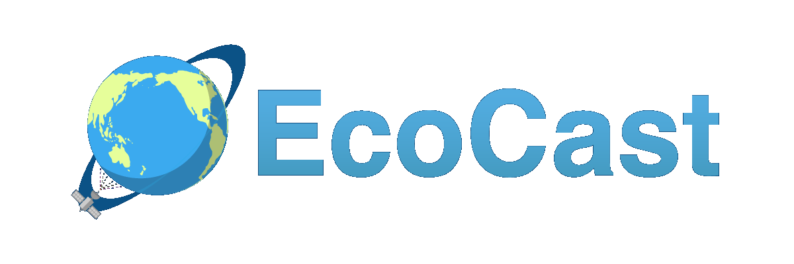

:::{.ecocast-page}

::: {.project-topbar}

  <a href="ecocast.qmd" class="project-brand-link">
    

<nav class="project-tabs" aria-label="EcoCast navigation">
  <a class="project-tab" href="about_ecocast.qmd">About EcoCast</a>
  <a class="project-tab" href="ecocast_map.qmd">EcoCast Map</a>
  <a class="project-tab active" href="ecocast_explorer.qmd">EcoCast Explorer</a>
</nav>

:::

:::{.ecocast-map-zoom}

::: {.ecocast-card}

<strong>Information & Instructions</strong>

EcoCast Explorer gives users an opportunity to explore how the EcoCast product works. Users are able to generate predictive maps for specific dates, for single species, and can change the species weightings. This tool gives users the ability to explore how species are responding to changing ocean conditions, and how that can influence the EcoCast Product.

- Select a historical date to view model output.  
- Adjust species weightings to reflect management priorities:  

  - Negative values (leatherbacks, blue sharks, sea lions) → bias towards avoiding bycatch.  
  - Positive values (swordfish) → bias towards catching target species.  

- Customize the display by using dropdowns to filter the EcoCast map, change map extent, or add additional map elements.

---

<iframe 
  src="https://heatherwelch.shinyapps.io/ecocastapp/" 
  width="100%" 
  height="800" 
  style="border:none; border-radius:6px;">
</iframe>

If the embedded app does not load,  [open EcoCast Explorer](https://heatherwelch.shinyapps.io/ecocastapp/).

:::

---

::: {.ecocast-disclaimer}

The information on this page may be used and redistributed freely, but is not intended for legal use. Neither the data contributors, EcoCast partner organizations, CoastWatch, NOAA SWFSC, nor any of their employees or contractors, makes any warranty, express or implied, including warranties of merchantability and fitness for a particular purpose, or assumes any legal liability for the accuracy, completeness, or usefulness of this information. Although it is distributed by the NOAA CoastWatch West Coast Regional Node, this product is solely the responsibility of the [EcoCast project (.pdf)](https://www.westcoast.fisheries.noaa.gov/publications/fishery_management/hms_program/swordfish2015/ecocast_infosheet.pdf) and is not associated with NOAA CoastWatch. For official information about EcoCast contact [Elliott Hazen](https://coastwatch.pfeg.noaa.gov/ecocast/mailto@elliott.hazen@noaa.gov?Subject=EcoCast) or [Heather Welch](https://coastwatch.pfeg.noaa.gov/ecocast/mailto@heather.welch@noaa.gov?Subject=EcoCast).
:::

:::

:::
