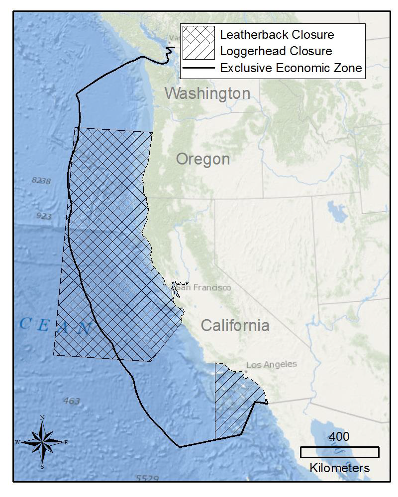
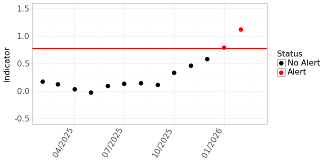

::: {.turtlewatch-page}

::: {.status-card}

  Loading closure status...
  

  NMFS has reopened the Pacific Loggerhead Conservation Area (LCA) to fishing with drift gillnets (DGN). The LCA had been close to DGN since June 1, 2024. (Posted 8/1/2024) 

<small>
*[Closure status provided by NOAA Fisheries West Coast Regional Office](https://www.westcoast.fisheries.noaa.gov/)*
</small>

:::

::: {.status-card}
### Environmental Conditions

::: {.status-grid}

::: {.status-subcard}

#### El Niño: Loading... {.subcard-title}
**Updated:** Loading...

**Forecast:**
Loading ENSO synopsis...

<small>*<a id="nino-link" href="https://www.cpc.ncep.noaa.gov/products/analysis_monitoring/enso_advisory/ensodisc.shtml" target="_blank">NOAA’s Climate Prediction Center</a>*</small>

---

#### Marine Heatwave (MHW) {.subcard-title}
**Forecast period:** Loading...

**Loading...**

<strong>North Pacific:</strong> Loading...

<strong>Tropical Pacific:</strong> Loading...

<small>*<a id="heat-link" href="https://psl.noaa.gov/marine-heatwaves/#report" target="_blank">NOAA’s Marine Heatwave Forecast</a>*</small>

:::

::: {.status-subcard}
#### Closure Area Sea Temperature

<label><input type="radio" name="temp-unit" value="C" checked> °C</label>
<label><input type="radio" name="temp-unit" value="F"> °F</label>

  
Loading temperature data...

<small>
Recent and historical monthly sea surface temperatures within the Loggerhead sea turtle conservation area.  
Dataset: [GHRSST MUR](https://coastwatch.pfeg.noaa.gov/erddap/search/index.html?page=1&itemsPerPage=1000&searchFor=mur+sst)
</small>

{.lightbox width="60%"}

:::

:::
:::

::: {.status-card}
### TOTAL Bycatch Avoidance Tool

::: {.status-grid}

::: {.status-subcard}

#### TOTAL Time Series {.subcard-title}
:::{.status-info}
- **Most recent forecast:** Loading...
- **Status:** Loading...
- **Indicator value:** Loading...
- **Updated:** Loading...
:::

This year’s **Temperature Observations To Avoid Loggerhead (TOTAL)** values for the Loggerhead Conservation Area. An alert is indicated when indicator values (the timeseries) exceed a threshold of **0.77 (red horizontal line)**.

{#indicator-plot fig-align="center"}
:::

:::
:::

::: {.status-card}
### Monthly Sea Surface Maps

::: {.status-grid}

::: {.status-subcard}
#### Sea Surface Temperature 2025 {.subcard-title}

:::{.sst-slider}
[‹ Previous]{.prev}
[Next ›]{.next}

{#sst-dash-image}
:::

Monthly mean sea surface temperature off Southern California. The Pacific Loggerhead Conservation Area is located within the black lines and the coast. Use arrows to view the last six months of measurements. 

Dataset: [GHRSST MUR](https://coastwatch.pfeg.noaa.gov/erddap/griddap/jplMURSST41mday.graph)

:::

::: {.status-subcard}
#### Sea Surface Temperature Anomaly 2025 {.subcard-title}

:::{.anom-slider}
[‹ Previous]{.prev}
[Next ›]{.next}

{#anom-image}
:::
Monthly mean surface temperature anomaly (deviation from the average temperature) off Southern California. The Pacific Loggerhead Conservation Area is located within the black lines and the coast. Use arrows to view the last six months of measurements.

Dataset: [GHRSST MUR](https://coastwatch.pfeg.noaa.gov/erddap/griddap/jplMURSST41anommday.graph)

:::
:::

:::

::: {.turtlewatch-disclaimer}
The information on this page may be used and redistributed freely, but is not intended for legal use. Neither the data contributors, CoastWatch, NOAA SWFSC, nor any of their employees or contractors, makes any warranty, express or implied, including warranties of merchantability and fitness for a particular purpose, or assumes any legal liability for the accuracy, completeness, or usefulness of this information. For official information about El Niño/La Niña contact [NOAA's Climate Prediction Center](https://www.cpc.ncep.noaa.gov/products/analysis_monitoring/enso_advisory/ensodisc.shtml). For official information about regulation of the drift gillnet (DGN) fishery contact [NOAA Fisheries West Coast Regional Office](https://www.westcoast.fisheries.noaa.gov/).
:::

:::

