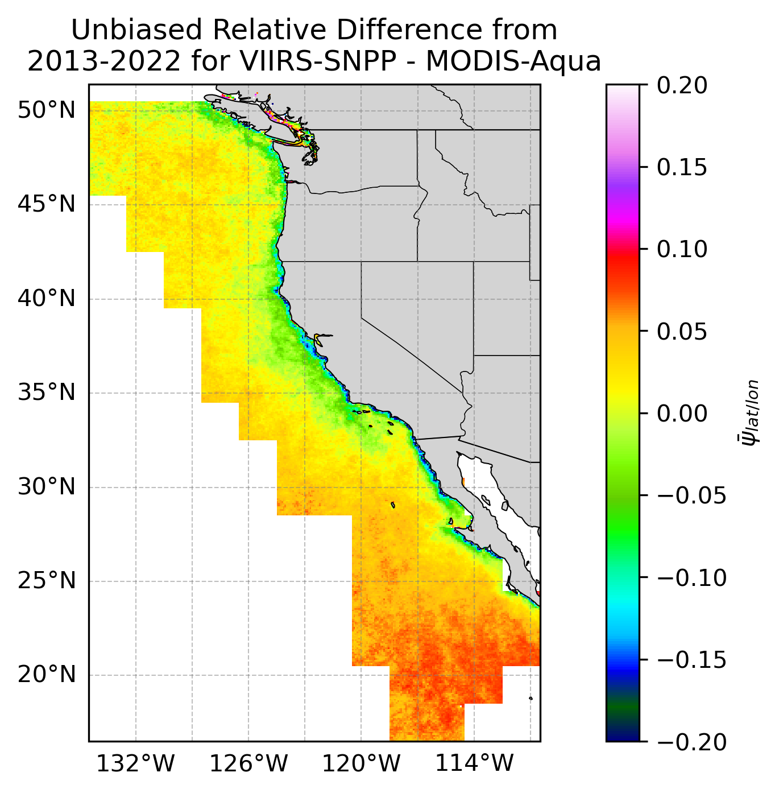
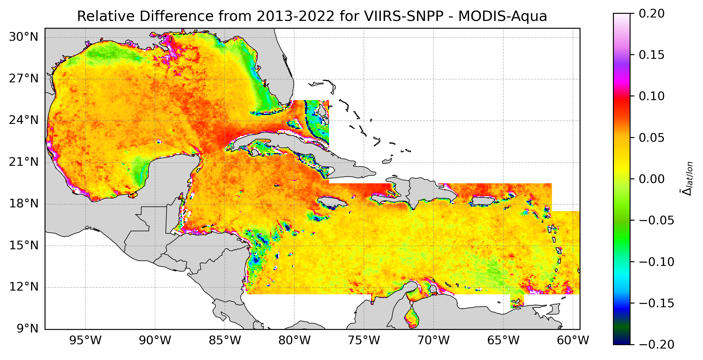
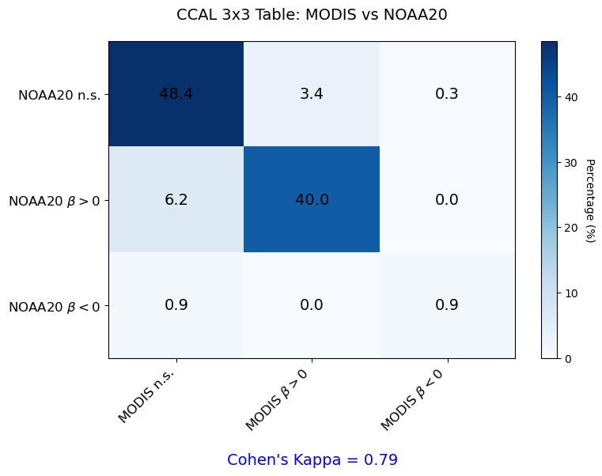

::: {.netpp-page}

::: {.project-topbar}

  <nav class="project-tabs" aria-label="NetPP navigation">
    <a class="project-tab is-brand" href="netpp.qmd">VIIRS NetPP Products</a>
    <a class="project-tab" href="algorithm-data.qmd">Algorithm & Data</a>
    <a class="project-tab" href="statistical-analysis.qmd">Statistical Analysis</a>
    <a class="project-tab active" href="user-resources.qmd">User Resources</a>
  </nav>

:::

## Code Gallery

Explore tutorials designed to help users analyze and compare legacy and interim primary productivity products using Python or R.

### Customizable Regional Analysis Tutorials

::: {.tutorial-grid}

::: {.tutorial-card}

### Unbiased Relative Difference Analysis of the Legacy and Interim Products

Calculate the mean unbiased relative difference ($\psi$) between the legacy and interim products for a user-specified region.

<a href="https://github.com/coastwatch-wcn/coastwatch-wcn/tree/main/tutorials/Python/longhurst/unbiased_relative_difference/longhurst_unbiased_relative_difference.ipynb" class="tutorial-btn" target="_blank">Python Tutorial</a>

<a href="https://github.com/coastwatch-wcn/primary_productivity/tree/main/tutorials/R/longhurst/unbiased_relative_difference/longhurst_unbiased_relative_difference.Rmd" class="tutorial-btn" target="_blank">R Tutorial</a>

:::

::: {.tutorial-card}

### Absolute Relative Difference Analysis of the Legacy and Interim Products

Calculate the absolute relative difference ($\Delta$) between the legacy and interim products for a user-specified region.

<a href="https://github.com/coastwatch-wcn/primary_productivity/tree/main/tutorials/Python/longhurst/absolute_relative_difference/longhurst_absolute_relative_difference.ipynb" class="tutorial-btn" target="_blank">Python Tutorial</a>

<a href="https://github.com/coastwatch-wcn/primary_productivity/tree/main/tutorials/R/longhurst/absolute_relative_difference/longhurst_absolute_relative_difference.Rmd" class="tutorial-btn" target="_blank">R Tutorial</a>

:::

::: {.tutorial-card}

### Contingency Tables: Assessing the Similarity Between Two Primary Productivity Products

Construct a contingency matrix to compare the trends between the legacy and interim products for a user-specified region.

<a href="https://github.com/coastwatch-wcn/primary_productivity/tree/main/tutorials/Python/longhurst/contingency_matrix/longhurst_contingency_matrices.ipynb" class="tutorial-btn" target="_blank">Python Tutorial</a>

<a href="https://github.com/coastwatch-wcn/primary_productivity/tree/main/tutorials/R/longhurst/contigency_matrix/longhurst_contingency_matrices.Rmd" class="tutorial-btn" target="_blank">R Tutorial</a>

:::

:::

---

### Full Statistical Analysis Tutorials

::: {.tutorial-grid}

::: {.tutorial-card}

### Primary Productivity Unbiased Relative Difference Analysis

Calculate the mean unbiased relative difference ($\psi$) of the interim VIIRS netPP and legacy MODIS netPP products for each month from the time series shared between the two sensors.

<a href="https://github.com/coastwatch-wcn/coastwatch-wcn.github.io/tree/main/projects/primary-productivity/tutorials/Python/raw_calculations/unbiased_relative_difference/raw_unbiased_relative_difference.ipynb" class="tutorial-btn" target="_blank">Python Tutorial</a>

<a href="https://github.com/coastwatch-wcn/coastwatch-wcn.github.io/tree/main/projects/primary-productivity/tutorials/R/raw_calculations/unbiased_relative_difference/raw_unbiased_relative_difference.Rmd" class="tutorial-btn" target="_blank">R Tutorial</a>

:::

::: {.tutorial-card}

### Primary Productivity Absolute Relative Difference Analysis

Calculate the mean absolute relative difference ($\Delta$) of the interim VIIRS netPP product and legacy MODIS netPP product for each month from a time series shared between the two sensors.

<a href="https://github.com/coastwatch-wcn/coastwatch-wcn.github.io/tree/main/projects/primary-productivity/tutorials/Python/raw_calculations/absolute_relative_difference/raw_absolute_relative_difference.ipynb" class="tutorial-btn" target="_blank">Python Tutorial</a>

<a href="https://github.com/coastwatch-wcn/coastwatch-wcn.github.io/tree/main/projects/primary-productivity/tutorials/R/raw_calculations/absolute_relative_difference/raw_absolute_relative_difference.Rmd" class="tutorial-btn" target="_blank">R Tutorial</a>

:::

::: {.tutorial-card}

### Calculating Trends and P-Values for Legacy and Interim NetPP Products

Generate trends for satellite-derived hourly means of legacy or interim primary productivity products.

<a href="https://github.com/coastwatch-wcn/coastwatch-wcn.github.io/tree/main/projects/primary-productivity/tutorials/Python/raw_calculations/trends/raw_trends_primary_productivity.ipynb" class="tutorial-btn" target="_blank">Python Tutorial</a>

<a href="https://github.com/coastwatch-wcn/coastwatch-wcn.github.io/tree/main/projects/primary-productivity/tutorials/R/raw_calculations/trends/raw_trends_primary_productivity.Rmd" class="tutorial-btn" target="_blank">R Tutorial</a>

:::

:::

## Satellite Courses

    CoastWatch hosts satellite training opportunities in-person and online, providing users with the knowledge and skills to utilize satellite data in their research.

<a href="https://coastwatch-training.github.io/trainings/" target="_blank" style="text-decoration: none;">
    <button style="padding: 10px 20px; font-size: 18px; color:white; background-color:  #0072ce; border: none; border-radius: 5px; cursor: pointer; font-weight: bold;">
        Satellite Courses&rarr;
    </button>
</a>

## ERDDAP Server

    Search satellite data on the CoastWatch West Coast Node ERDDAP data server.

<a href="https://coastwatch.pfeg.noaa.gov/erddap/index.html" target="_blank" style="text-decoration: none;">
    <button style="padding: 10px 20px; font-size: 18px; color:white; background-color:  #0072ce; border: none; border-radius: 5px; cursor: pointer; font-weight: bold;">
        ERDDAP&rarr;
    </button>
</a>

## Download Interim Product Data

::: {.download-grid}

::: {.download-card}

### VIIRS SNPP Interim Primary Productivity

<a href="https://coastwatch.pfeg.noaa.gov/erddap/griddap/productivity_viirs_snpp_daily_nrt.graph" target="_blank" class="download-link">
Daily Composites, Near Real-time
</a>

<a href="https://coastwatch.pfeg.noaa.gov/erddap/griddap/productivity_viirs_snpp_daily.graph" target="_blank" class="download-link">
Daily Composites, Science Quality
</a>

<a href="https://coastwatch.pfeg.noaa.gov/erddap/griddap/productivity_viirs_snpp_monthly.graph" target="_blank" class="download-link">
Monthly Composites, Science Quality
</a>

:::

::: {.download-card}

### VIIRS NOAA-20 Interim Primary Productivity

<a href="https://coastwatch.pfeg.noaa.gov/erddap/griddap/productivity_viirs_noaa20_daily_nrt.graph" target="_blank" class="download-link">
Daily Composites, Near Real-time
</a>

<a href="https://coastwatch.pfeg.noaa.gov/erddap/griddap/productivity_viirs_noaa20_daily.graph" target="_blank" class="download-link">
Daily Composites, Science Quality
</a>

<a href="https://coastwatch.pfeg.noaa.gov/erddap/griddap/productivity_viirs_noaa20_monthly.graph" target="_blank" class="download-link">
Monthly Composites, Science Quality
</a>

:::

:::

---

## Download Algorithm Input Data

::: {.download-grid}

::: {.download-card}

### MODIS Aqua netPP

<a href="https://coastwatch.pfeg.noaa.gov/erddap/griddap/erdMH1pp1day.graph" target="_blank" class="download-link">
Daily Composite
</a>

<a href="https://coastwatch.pfeg.noaa.gov/erddap/griddap/erdMH1ppmday.graph" target="_blank" class="download-link">
Monthly Composite
</a>

:::

::: {.download-card}

### MODIS Aqua Input Data for Legacy netPP

<a href="https://coastwatch.pfeg.noaa.gov/erddap/griddap/erdMH1chlamday_R2022SQ.graph" target="_blank" class="download-link">
MODIS Chlorophyll a
</a>

<a href="https://coastwatch.pfeg.noaa.gov/erddap/griddap/erdMH1par0mday_R2022SQ.graph" target="_blank" class="download-link">
MODIS PAR
</a>

<a href="https://www.earthdata.nasa.gov/" target="_blank" class="download-link">
MODIS SST
</a>

:::

::: {.download-card}

### VIIRS SNPP Input Data for Interim netPP

<a href="https://coastwatch.pfeg.noaa.gov/erddap/griddap/erdVH2018chlamday.graph" target="_blank" class="download-link">
VIIRS SNPP Chlorophyll a
</a>

<a href="https://coastwatch.pfeg.noaa.gov/erddap/griddap/erdVH2018parmday.graph" target="_blank" class="download-link">
VIIRS SNPP PAR
</a>

<a href="https://www.earthdata.nasa.gov/" target="_blank" class="download-link">
VIIRS SNPP SST
</a>

:::

::: {.download-card}

### VIIRS NOAA-20 Input Data for Interim netPP

<a href="https://www.earthdata.nasa.gov/" target="_blank" class="download-link">
VIIRS NOAA20 Chlorophyll a
</a>

<a href="https://www.earthdata.nasa.gov/" target="_blank" class="download-link">
VIIRS NOAA20 PAR
</a>

<a href="https://www.earthdata.nasa.gov/" target="_blank" class="download-link">
VIIRS NOAA20 SST
</a>

:::

:::

---

## Download Statistical Analysis Data Products

::: {.download-grid}

::: {.download-card}

### Unbiased Relative Difference (&psi;)

<a href="https://coastwatch.pfeg.noaa.gov/wcn/erddap/griddap/netpp_psi_snpp_modis.graph" target="_blank" class="download-link">
VIIRS-SNPP - MODIS-Aqua
</a>

<a href="https://coastwatch.pfeg.noaa.gov/wcn/erddap/griddap/netpp_psi_noaa20_modis.graph" target="_blank" class="download-link">
VIIRS-NOAA-20 - MODIS-Aqua
</a>

:::

::: {.download-card}

### Absolute Relative Difference (&Delta;)

<a href="https://coastwatch.pfeg.noaa.gov/wcn/erddap/griddap/netpp_delta_snpp_modis.graph" target="_blank" class="download-link">
VIIRS-SNPP - MODIS-Aqua
</a>

<a href="https://coastwatch.pfeg.noaa.gov/wcn/erddap/griddap/netpp_delta_noaa20_modis.graph" target="_blank" class="download-link">
VIIRS-NOAA-20 - MODIS-Aqua
</a>

:::

::: {.download-card}

### Linear Regression Trends

<a href="https://coastwatch.pfeg.noaa.gov/wcn/erddap/griddap/netpp_trends_viirssnpp_and_modisaqua.graph" target="_blank" class="download-link">
MODIS-Aqua & VIIRS-SNPP
</a>

<a href="https://coastwatch.pfeg.noaa.gov/wcn/erddap/griddap/netpp_trends_viirsnoaa20_and_modisaqua.graph" target="_blank" class="download-link">
MODIS-Aqua & VIIRS-NOAA-20
</a>

:::

:::

:::